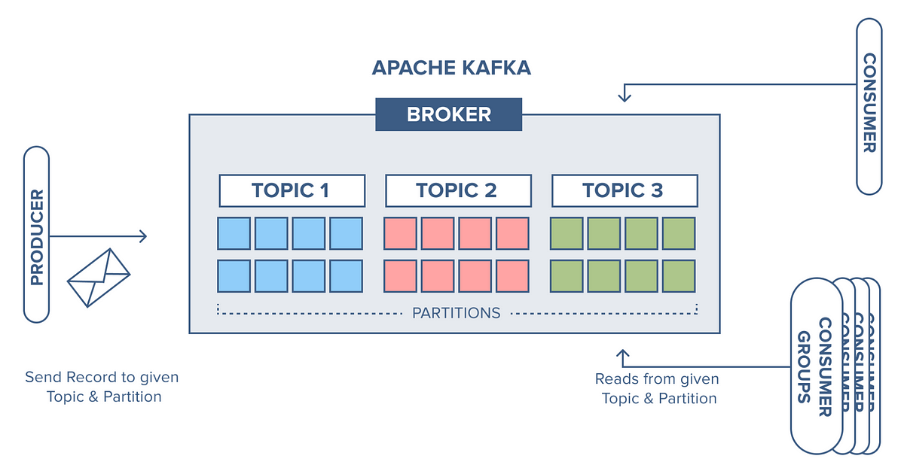

# Kafka
Apache Kafka is a high-performance, distributed messager that allows for the source and target systems to be decoupled. It provides high scalability, performance and fault tolerance, making it widely used for applications like real-time recommendations, analytics and microservices.



- Source system: website events, pricing data, transactions, user interactions etc.
- Target systems: Databases, analytics, email systems, audit etc.
- If we have many source and target systems, it can become difficult:
5 sources and 7 targets is 35 intgrations. 
- Each integration can have a different protocol (HTTP, HTTPS, TCP, ...) data format and evolution. 
- This is why Kafka is used, as we can decouple all of this. 

## Use Cases
- Application log gathering
- Activity tracking
- Messaging system
- Metric gathering

## Examples
- Netflix use Kafka to deliver in-time recomendations to users. 
- LinkedIn use it to remove spam. 
- Uber use it for in-time anlysis and delivery. 

## Kafka Basics
### Topics
- They're categories or groups of related data.
- A sequence of messgaes is called a data stream.
- The topic is split into partitions, with messages ordered in each partition. 
- Each message in a partition gets an ID called an ofset. 
- Topics can't be changed (immutable). 

### Producers
- The producer decides and writes (sends data) to a partition. 
- They use Message Keys which is a key sent with a message to determine which partition to send to. 

### Messages
- The messages are created by the producer
- It only accepts bytes as the input, and outputs bytes to the consumer.
- Message serialisation transforms objects int bytes.

### Consumers
- Consumers read data from a topic (by name) using Pull the model.
- Automatically know which broker to read from. 
- Consumers can recover in case of broker failure.
- Data is read in order from low to high offset (within each partition). 

### Consumer Groups
- All consumers in an app read data as groups.
- Every consumer in a group reads exclusively from different partitions.
- We can have multiple consumer groups on the same topic.

### Consumer Offsets
- Kafka stores offsets at which consumer group has been reading.
- Offsets committed in Kafka topic called ``` __consumer_offsets ```
- When a consumer in group has processed data received from Kafka, it periodically commits offsets.
- If a consumer dies, it can read back from when it left off thanks to committed consumer offsets. By default, Java consumers automatically commit offsets (at least once).

### Brokers
- A cluster is composed of multiple brokers (servers). 
- Each broker contains certain topic partitions. 
- Each broker is identified with its ID (integer). 
- After connecting to any broker (bootstrap broker) you will be connected to the entire cluster.
- You only need to connect to one broker, and Kafka clients will know how to be connected to the entire cluster (smart clients). 

### Topic Replication Factor
- If a broker is down, another broker can serve the data. 
- Topics should have replication factor greater than 1, and usually between 2 and 3. 

### Partition leader
- At any time only ONE broker can be a leader for a partition, and producers can only send data to the leader broker.
- Other brokers replicate the data. 
- Each partition has one leader and multiple ISR (In-sync replica).
- Consumers by default will read from a leader broker.
- If the leader goes down, a replica can provide the data and become the leader.

### Producer Acknowledgements
- acks=0 - Producer wont wait for acknowledgement (possible data loss).
- acks=1 - Producer wait for leader acknowledgement (limited data loss).
- acks=all - Leader and replicas acknowledgement (no data loss). 

### Zookeeper
- Manages brokers (keeps list of them) and helps perform leader election for partitions.
- Sends notifications to Kafka in case of changes (e.g. new topics, broker dies etc.).
- In 2020, Kafka started removing Zookeeper dependency. 